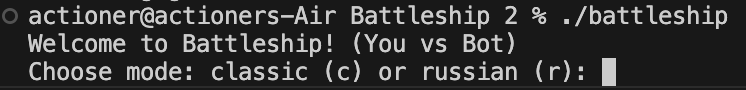
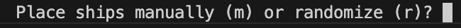
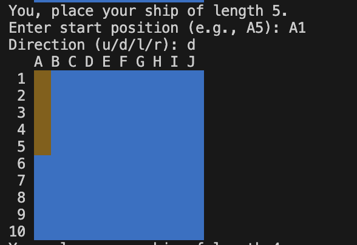
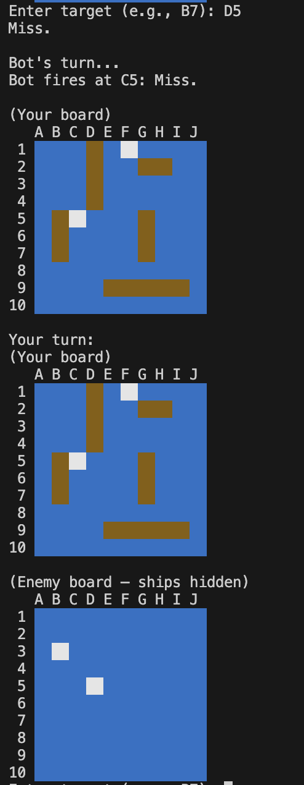

# Battleship
This project is for a C++ model of the popular game "Battleship", supporting player vs player and player vs bot.

Battleship is a 2-player game where on a 10x10 board, each player places ships on certain cells which are unknown to the other player. Players take turn guessing cells on the board, and are informed whether their guess hit the other player's boat. Once all cells containing a player's ship has been hit, that ship is sunken. The first player to sink all of the others' boats is the winner.

### Game Modes

At the start of the game, the program will ask two things:
1) Classic mode or Russian mode

Classic is standard Battleship, where each player has boats of length 5,4,3,3, and 2.

The Russian mode is a variant where each player has boats of length 4,3,3,2,2,2,1,1,1, and 1. In short, 1 boat of length 4, 2 boats of length 3, 3 boats of length 2, and 4 of length 1.

The Russian mode is harder due to there being more boats in number, and smaller ones being harder to find.

After the player chooses the mode, by inputting 'c' or 'r', they are asked
  
2) whether to place ships manually or use the built-in randomize function

using the randomize function by inputting 'r' will lead to the built-in randomize function being called. This is a heuristic function that places the player's ships "randomly" by randomly choosing an avaliable square and then randomly choosing an available direction to extend that boat, then placing it. This process is repeated until all are placed.

using the 'm' selection will allow the player to manually input each of their boats' positions as follows:

The player will be asked the starting square of their boat, and then the direction in which it will extend, where they indicate that through the characters 'u' for up, 'r' for right, etc. All inputs are validated and allow re-input.

## Main Game

Once the game has been set-up with the mode chosen and boats placed, players take turn in guessing cells in each other's boards, which they indicate through inputs like A10, which corresponds to the 10th row and 1st column (A->1). If a player guesses a correct cell, "hitting" the boat, the cell turns red and their turn continues. Once all of the cells on a boat are hit and the boat sinks, all of the red cells turn into brown, indicating a sunken ship. 

Furthermore, sinking a ship causes all of its neighboring squares to turn white, as no other ship can be adjacent to another, making it easier for the player to visualize.

Wrong guesses are indicated with a white square to avoid double-guessing (which the program won't allow and will ask re-input) and cells that haven't been hit yet are colored blue, representing the undisturbed water.

A sample run of a turn is shown below

## Sample Turn

In this sample turn, the player is playing against the bot. They fire at D5 and the program returns "Miss." meaning that now it is the bot's turn. The bot fires at C5 and also misses. Later, both the player's own board and the bot's board are printed. Yet, the player isnt shown the boats of the bot. D5 and C5 are now colored white to reflect the recent guesses.

## How the (Smart) Bot works

The bot starts by firing at randomly chosen squares. 

Once it hits a ship, and the cell turns red, it enters its sinking state. It starts guessing adjacent squares until it finds which direction the ship extends. Once it finds the direction, it (smartly) continues guessing adjacent squares in that direction until the ship is finally sunken.

After that, it returns to its original state firing at randomly chosen squares (squares which are possible to contain a boat) until it hits again.
